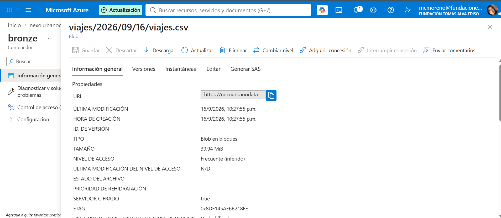

# NexoUrbano 2026 — pack del TP

Este directorio es el **pack de cátedra** del trabajo práctico evaluativo.

| Archivo | Quién lo usa |
|---|---|
| [TP_NexoUrbano_2026.md](TP_NexoUrbano_2026.md) | Estudiantes (enunciado completo) |
| [ANEXO_DOCENTE.md](ANEXO_DOCENTE.md) | Docentes (rúbrica viva, orales, plan B) |
| [tools/generar_datos.py](tools/generar_datos.py) | Squads, día 0 |
| [docker-compose.yml](docker-compose.yml) | Mongo, Cassandra, Neo4j, MySQL, MinIO |
| [contratos/bronze_viajes.yaml](contratos/bronze_viajes.yaml) | Plantilla de data contract |
| [.env.example](.env.example) | Secretos fuera de Git |

## Arranque en 10 minutos

```bash
python3 tools/generar_datos.py --seed 101 --n-viajes 250000
docker compose up -d mysql mongo minio
```

Luego cada squad copia la estructura de carpetas del enunciado a **su** repositorio (no entreguen este pack mezclado con el producto).

## Semilla

`--seed` = número de grupo × 100 + comisión. Dos grupos con la misma semilla tienen los mismos IDs: eso se considera copia.

## Hardware

- 8 GB RAM: levantar **un** NoSQL a la vez.
- 16 GB: MySQL + Mongo + Neo4j juntos; Cassandra aparte.
- Hadoop/Hive/HBase: sandbox Docker de la cátedra o el que documente el squad.

Azure y Databricks van por **cuenta free / Community**. Si piden tarjeta, MinIO + Spark local con ADR de paridad (está permitido en el enunciado).

## M2 - Azure Data Lake

**Suscripción:** Azure subscription 1
**Región:** Brazil South
**SKU:** Standard_LRS

**URI del dataset en Bronze:**

​```
abfss://bronze@nexourbanodata2026.dfs.core.windows.net/viajes/2026/09/16/viajes.csv
​```

**Evidencia del contenedor:**



