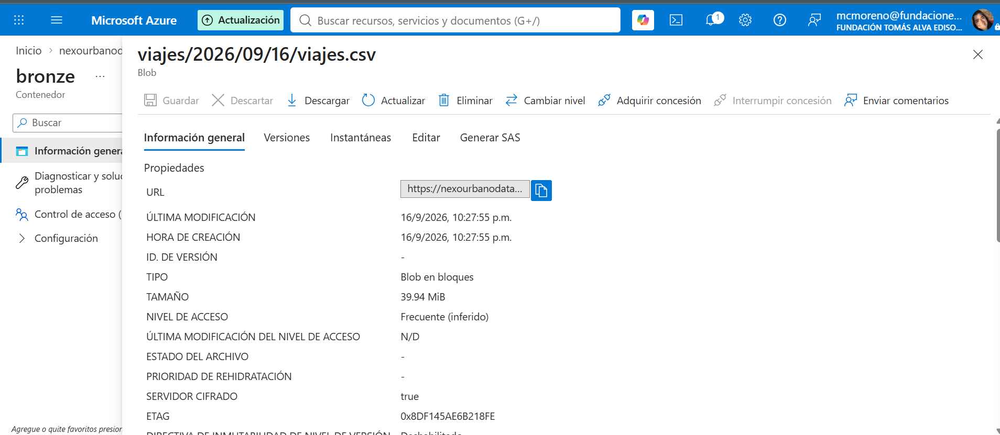

# NexoUrbano 2026 — pack del TP

Este directorio es el **pack de cátedra** del trabajo práctico evaluativo.

| Archivo | Quién lo usa |
|---|---|
| [TP_NexoUrbano_2026.md](TP_NexoUrbano_2026.md) | Estudiantes (enunciado completo) |
| [ANEXO_DOCENTE.md](ANEXO_DOCENTE.md) | Docentes (rúbrica viva, orales, plan B) |
| [tools/generar_datos.py](tools/generar_datos.py) | Squads, día 0 |
| [docker-compose.yml](docker-compose.yml) | Mongo, Cassandra, Neo4j, MySQL, MinIO |
| [contratos/bronze_viajes.yaml](contratos/bronze_viajes.yaml) | Plantilla de data contract |
| [.env.example](.env.example) | Secretos fuera de Git |

## Arranque en 10 minutos

```bash
python3 tools/generar_datos.py --seed 101 --n-viajes 250000
docker compose up -d mysql mongo minio
```

Luego cada squad copia la estructura de carpetas del enunciado a **su** repositorio (no entreguen este pack mezclado con el producto).

## Semilla

`--seed` = número de grupo × 100 + comisión. Dos grupos con la misma semilla tienen los mismos IDs: eso se considera copia.

## Hardware

- 8 GB RAM: levantar **un** NoSQL a la vez.
- 16 GB: MySQL + Mongo + Neo4j juntos; Cassandra aparte.
- Hadoop/Hive/HBase: sandbox Docker de la cátedra o el que documente el squad.

Azure y Databricks van por **cuenta free / Community**. Si piden tarjeta, MinIO + Spark local con ADR de paridad (está permitido en el enunciado).

## M2 - Azure Data Lake

**Suscripción:** Azure subscription 1
**Región:** Brazil South
**SKU:** Standard_LRS

**URI del dataset en Bronze:**

​```
abfss://bronze@nexourbanodata2026.dfs.core.windows.net/viajes/2026/09/16/viajes.csv
​```

**Evidencia del contenedor:**



## M8 - Spark batch (Bronze → Silver → Gold)

**Script:** `05-spark/batch/job_gold.py`

**Cómo correrlo** (con Docker Desktop abierto):

    docker compose up -d spark
    docker compose exec -u root spark chown -R spark /opt/spark-lake
    docker compose exec spark /opt/spark/bin/spark-submit --master "local[*]" --driver-memory 2g /opt/spark-apps/batch/job_gold.py

El `chown` se corre una sola vez: le da permisos al usuario `spark` para escribir en el volumen `spark_lake`. Silver y Gold se guardan en ese volumen de Docker y no están en el repo. Para verlos: `docker compose exec spark ls /opt/spark-lake/gold`.

**Volumen:** 250.000 viajes (seed 402). 

**Calidad de dato (Bronze → Silver):** 244.944 de 250.000 filas pasan (98%). Se rechazaron 5.045 por duración fuera del rango 30 s – 4 h y 11 por km inválido. Las reglas de ids nulos y fin antes que inicio no rechazaron ninguna.

**Zona horaria:** `ts_start` viene en UTC y se convierte a hora de Buenos Aires antes de agrupar por fecha y hora. Por eso el primer día (28/02) tiene solo 312 viajes: los datos arrancan el 01/03 00:00 UTC, que son las 21:00 locales del día anterior.

**Silver:** Parquet particionado por `fecha`.

**Gold:**
- `gold_ops_diaria`: viajes, minutos, km, ingresos y % de clima adverso por día. Los ingresos son la suma de `fare_ars` del CSV.
- `top_estaciones_origen`: las 10 estaciones con más viajes.
- `gold_por_plan`: viajes, ingresos y duración media por plan de rider.

**Join con riders:** `data/riders.csv` (120 riders) se une por `rider_id`. Se usó el CSV directo y no la tabla de Sqoop (M7). 0 viajes quedaron sin rider. En el plan físico Spark eligió `BroadcastHashJoin`, porque la tabla es chica.

**Clima adverso:** `clima_codigo >= 51` (61, 63 y 80). Parecen códigos de lluvia, pero es una inferencia: el generador no los documenta. Resultado: 33,4% de los viajes. El código viene en el CSV de viajes.

**Explain:** ver `evidencias/spark/salida_job_gold.txt` y el análisis en `evidencias/spark/explain_notas.md`. Se observan partition pruning (`PartitionFilters` sobre `fecha`), column pruning (`ReadSchema` con una sola columna) y broadcast join.

**Observaciones sobre los datos:**
- El 71,8% de los viajes supera los 25 km/h y el 44,4% los 60 km/h, algo irreal para monopatines. No se filtró por velocidad porque eliminaría más de la mitad del dataset. Una hipótesis es que el generador sortea km y duración por separado, pero no se verificó.
- El clima, los km, la duración y el plan se generan de forma independiente. Por eso el % de clima adverso es casi igual cada día y los planes no se diferencian entre sí.

**Límite de los datos:** el generador sortea clima, km, duración y plan de forma independiente, por eso el % de clima adverso es casi igual cada día y los planes no se diferencian.


### M9 · Spark Streaming: Alertas Operacionales

**Caso de Uso y Reglas de Negocio**
El sistema procesa telemetría en vivo para detectar monopatines con batería baja (`battery_low`) o fallos de pago recurrentes (`payment_fail`) agrupados en ventanas móviles de 2 minutos (con un slide de 30 segundos). Esto permite alertar a operaciones sobre posibles fraudes de "viaje fantasma" o desconexiones masivas de la flota. Los resultados se emiten por consola y se persisten simultáneamente en formato Parquet (`gold_alerts`) para auditoría.

**Gestión de Latencia (Watermark) y Eventos Descartados**
Se configuró un *watermark* de 1 minuto para tolerar el retraso natural de la red móvil. Si el reloj interno del streaming avanza y fija su límite mínimo (ej. 12:01:00), cualquier monopatín que recupere la señal y envíe un evento tardío (ej. un registro a las 12:00:33) es descartado automáticamente por el sistema. Esto se validó en las pruebas para asegurar que no se recalculen ventanas ya cerradas.

**Hechos Mínimos Verificables (HMV)**
 **Demostración:** El video de 30 segundos mostrando la reacción en vivo de la consola y la creación de las ventanas se encuentra en: `evidencias/spark/evidencia_m9_alertas.mp4`
**Código:** El script de ejecución está en `job_alerts.py`
